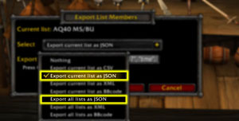

# KSK Classic Discord Bot

For Classic WoW guilds using the Konfer Suicide Kings loot system, this bot can post exported JSON results from the KSK addon to Discord.

The intent of this bot is to allow easy viewing of KSK positions for guild members, and also reduce the overhead for raid leaders and members needing to keep all of their addons in sync whenever someone wants to see their KSK position.

## Installation
[Click here](https://discord.com/api/oauth2/authorize?client_id=807655262961532938&permissions=26624&scope=bot) to add to your Discord server.

## Usage

Mention/tag the bot user `@KSK` when using the following commands.

### Command List

`@KSK post` Copy and paste the string provided by the KSK addon following this command.

`@KSK help` Displays the Discord bot help message.

### Notes

* Simply click the **Upload** button when prompted for strings that are larger than Discord's message limit.
* The bot can accept either a string or uploaded text file accompanying the `@KSK post` command.
* Large lists will be broken up into multiple messages due to Discord's message/embed limits.
* Outdated lists are automatically purged when the same list is posted again in the same channel.

### Getting the string

You must be a designated admin user in your guild's KSK system in order to export data.

Select the **Export** button in the **Config** tab.

>

Export either a single list (selected in the previous screen), or all your KSK lists, as **JSON**.

>

## Links and Notices

[Konfer Suicide Kings (KSK) for Classic WoW](https://www.curseforge.com/wow/addons/ksk-classic)

World of Warcraft®
©2004 Blizzard Entertainment, Inc. All rights reserved. World of Warcraft, Warcraft and Blizzard Entertainment are trademarks or registered trademarks of Blizzard Entertainment, Inc. in the U.S. and/or other countries.
